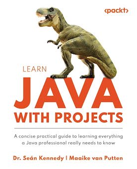

# Functional Java
Implementing lambda expression exercises from Learn Java With Projects by Dr. Sean Kennedy & Maaike van Putten
___
### Click [here](https://www.amazon.com/Learn-Java-Projects-everything-professional/dp/1837637180/ref=sr_1_1?crid=3H4JZKY6GSSX5&dib=eyJ2IjoiMSJ9.NrwQgmtjgVJXroYFKOuEKjmk4Q-KoFCM1dDGN9_AWQlhCwpPVDSJfS1fK8rxlxfq0ZzEBMAle1QFyERxjULdWdAuIqqvm4HafGtNNmQBcN9dDwRmOg5MxnsgOyZZeLw4EJhFvCnTp_ih1aEr6U6tQhYcGYK0B3QkxeUvt2Y5pFTmdQq6JtXOTf8H-QzEcXsdWDX4KbdakHj3R1WcXD2CS39iEv37bQRChWt7vYnqw3k.GQTRcup1lc4OJj7VvU19rU4nHU7NjBnWqEbgpTasmGs&dib_tag=se&keywords=learning+java+with+projects&qid=1728703615&sprefix=learning+java+with+projects%2Caps%2C158&sr=8-1) for Amazon Link:

 

