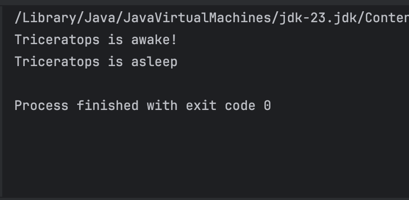

# Exercise 1 😴
___
Dinosaur care tasks are often very similar, but not identical. To make our code cleaner, we can
use lambda expressions. Create a custom functional interface called DinosaurHandler with
a method called handle(Dinosaur dinosaur). Implement it in a lambda expression that
sets a dinosaur to be asleep or awake (first, add a property to your Dinosaur class if needed).

